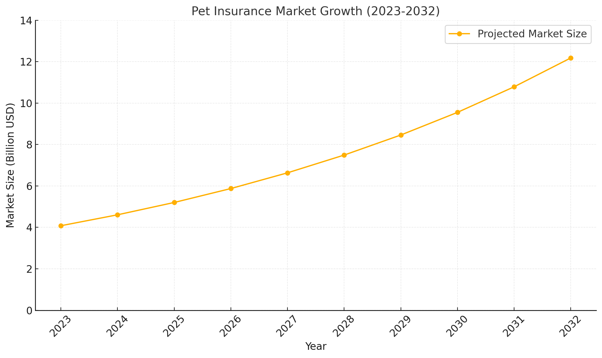

# Muzzlebook: Инновационное решение для идентификации животных и его рыночный потенциал

## Описание технологического продукта

Muzzlebook — это высокоточное IT-решение для автоматизированной идентификации животных по фотографии, построенное на базе передовых нейронных сетей. Продукт предназначен для широкого круга задач: от мониторинга популяций редких видов до оптимизации страховых процессов и управления фермерскими хозяйствами. 

Основной функционал Muzzlebook включает интеграцию через API, что позволяет клиентам (например, страховым компаниям или природоохранным организациям) легко использовать обученную модель для собственных нужд. Продукт отличается гибкостью: для уникальных задач заказчиков возможно обучение модели на их данных, а также кастомизация алгоритма для специфических условий, таких как идентификация редких видов или учет больших популяций животных. 

С точки зрения конкурентоспособности, Muzzlebook предлагает преимущества перед традиционными методами идентификации (например, RFID-метками) благодаря более низкой стоимости жизненного цикла, отсутствию необходимости в физическом взаимодействии с животными и высокой точности алгоритмов (до 90%) [1, 2]. Эти показатели делают продукт привлекательным как для коммерческих, так и для природоохранных организаций, стремящихся сократить затраты и повысить эффективность своих процессов.

## Анализ рынка

Идентификация животных представляет собой сложную задачу, особенно в контексте мониторинга популяций, страхования домашних питомцев и научных исследований. Muzzlebook предлагает решение, которое одновременно адресует несколько значимых проблем и соответствует растущим требованиям целевого рынка.

### Проблемы текущих решений

Одной из ключевых проблем является трудоемкость и высокая стоимость существующих методов идентификации. Традиционные подходы, такие как RFID-метки и ручная идентификация, требуют значительных ресурсов. Например, замена RFID-меток обходится зоопаркам и фермерским хозяйствам в $3 000–5 000 ежегодно при среднем объеме коллекции в 500 животных [3]. Анализ фото- и видеоматериалов вручную увеличивает риск ошибок, что замедляет процесс мониторинга и снижает точность данных. Эти недостатки особенно ощутимы в природоохранной деятельности. Данные WWF (нежелательная организация, выполняющая функции иностранного агента) [4] показывают, что усилия по защите видов страдают из-за недостаточно точного учета популяций.

Сфера страхования домашних животных также сталкивается с проблемами их идентификации. Многие страховые компании могут испытывать трудности с подтверждением личности животных, что увеличивает риски мошенничества и затягивает обработку заявлений. Muzzlebook способен устранить эти проблемы, предлагая высокоточный алгоритм идентификации, который минимизирует человеческий фактор.

### Целевой рынок и его потенциал

Muzzlebook ориентирован на несколько крупных сегментов, каждый из которых демонстрирует устойчивый рост:
- **Природоохранные организации:** такие как WWF и IUCN, используют технологии для мониторинга редких видов. Программа ООН UNEP стимулирует финансирование проектов по сохранению биоразнообразия, что открывает значительные возможности для внедрения Muzzlebook. 
- **Зоопарки и фермерские хозяйства:** крупные зоопарки, например, San Diego Zoo, ежегодно тратят до $50 000 на традиционные методы учета животных. Автоматизация может сократить эти затраты на 30–40%.  
- **Страховые компании** могут использовать Muzzlebook для автоматизации процессов идентификации, что позволит экономить до 20% времени на обработку претензий.  

Потенциал продукта также высок в развивающихся странах, где интерес к цифровизации растет. Согласно отчету Market Data Forecast, объем мирового рынка страхования домашних животных в 2023 году составил 4,08 миллиарда долларов США. Прогнозируется, что к 2032 году этот показатель достигнет 12,18 миллиарда долларов США, при среднегодовом темпе роста 12,92% в период с 2024 по 2032 годы [5].

Общий объем рынка, с которым взаимодействует Muzzlebook, составляет более $10 млрд.

| Страна/Регион   | Объем рынка ($ млрд) | Основные пользователи                                    | Особенности рынка                                                                                           |
|------------------|----------------------|----------------------------------------------------------|-------------------------------------------------------------------------------------------------------------|
| **США**         | 3,5                  | Petplan, Allstate, зоопарки, природоохранные организации          | Высокая цифровизация, развитая культура страхования питомцев, сильный спрос на автоматизацию.               |
| **Россия**       | 0,8                  | Росгосстрах, СБЕР, Т-Банк, фермерские хозяйства, зоопарки  | Высокая заинтересованность в учете скота, внедрение технологий замедлено из-за зависимости от традиционных методов. |
| **Китай**        | 2,0                  | Ping An, фермеры                     | Быстро растущий рынок домашних животных, особенно в мегаполисах, высокий интерес к цифровым решениям.        |
| **Индия**        | 0,5                  | Фермеры, природоохранные организации                     | Ограниченная цифровизация в сельских районах, но высокий потенциал для использования в аграрном секторе.     |
| **Австралия**    | 0,7                  | Страховые компании, природоохранные фонды                | Сильная культура защиты животных, популярность технологий для мониторинга дикой природы.                    |
| **Европейский Союз** | 5,2             | Allianz, другие страховые компании, фермерские зоопарки                   | Единый рынок с высокими стандартами защиты данных, интерес к автоматизированным решениям.                    |
| **Южная Корея**  | 0,6                  | Страховые компании, исследовательские институты          | Высокий уровень цифровизации, готовность к использованию инновационных технологий.                           |
| **Африка**       | 0,3                  | Природоохранные организации, фермеры                     | Ограниченная инфраструктура, высокий интерес к сохранению биоразнообразия через природоохранные проекты.      |

### Преимущества и перспективы

Несмотря на растущий спрос, многие существующие решения имеют узкую специализацию. Например, Pet Recognition Apps работают только с домашними животными и не подходят для сложных задач, таких как мониторинг дикой природы. Традиционные методы, включая RFID-метки, остаются дорогостоящими и требуют физического взаимодействия с животными.

Muzzlebook отличается универсальностью и гибкостью. Интеграция через API делает продукт доступным для клиентов с разным уровнем технической подготовки. Использование современных архитектур позволяет добиться точности, значительно превышающей показатели ближайших конкурентов. Кроме того, продукт адаптируется под уникальные задачи, такие как идентификация редких видов или управление крупными популяциями, что делает его привлекательным как для природоохранных организаций, так и для коммерческих клиентов.

Увеличение автоматизации и популяризация технологий искусственного интеллекта создают прочную основу для успеха Muzzlebook. По прогнозам, рынок автоматизированных решений для идентификации животных вырастет до $1,5 млрд к 2030 году. Сочетание универсальности, доступности и экономической эффективности позволит продукту занять лидирующую позицию в своей нише.

| Технология                          | Описание                                                                                                                                                                                                                                                                                                                                 | Преимущества                                                                                                                                                                                                                          | Недостатки                                                                                                                                                                                                                             |
|-------------------------------------|-----------------------------------------------------------------------------------------------------------------------------------------------------------------------------------------------------------------------------------------------------------------------------------------------------------------------------------------|---------------------------------------------------------------------------------------------------------------------------------------------------------------------------------------------------------------------------------------|----------------------------------------------------------------------------------------------------------------------------------------------------------------------------------------------------------------------------------------|
| **Традиционные ушные бирки**        | Метки, прикрепляемые к уху животного, содержащие информацию о породе, возрасте, поле и владельце.                                                                                                                                                                                                                                     | Простота и удобство использования; низкая стоимость.                                                                                                                                                                                 | Могут быть потеряны или удалены; требуют ручного сканирования; ограниченный объем информации.                                                                                                                                          |
| **RFID-метки**                      | Электронные чипы, содержащие цифровые данные о животном, вживляемые под кожу или прикрепляемые к ушам.                                                                                                                                                                                                                                 | Быстрое и точное сканирование; хранение большого объема данных; долговечность; бесконтактное считывание.                                                                      | Высокая стоимость внедрения; необходимость специального оборудования для считывания; возможные проблемы с точностью считывания в присутствии металлов или жидкостей.                                                                 |
| **Микрочипы (чипирование)**         | Внедрение под кожу животного интегральной схемы для присвоения уникального номера.                                                                                                                                                                                                                                                     | Постоянная идентификация; невозможность потери или удаления; уникальный номер для каждого животного.                                                                                                                                  | Требуется инвазивная процедура для внедрения; необходимость специального оборудования для считывания; ограниченный объем хранимой информации.                                                                                        |
| **Приложения для идентификации животных** | Приложения, использующие искусственный интеллект для распознавания животных по фотографии, такие как Animal Identifier. | Быстрая и удобная идентификация; возможность использования на мобильных устройствах. | Возможные ограничения в условиях плохого освещения или качества изображения. Узкая направленность. |
| **Muzzlebook**                      | Система, использующая искусственный интеллект для идентификации животных по уникальным признакам морды. | Быстрая и удобная идентификация. Гибкий API допускает интеграцию с различными технологическими решениями. Широкая специализация. | Возможные ограничения в условиях плохого освещения или качества изображения.      

## Стейкхолдеры и их роль в развитии Muzzlebook

Развитие продукта Muzzlebook неизбежно связано с взаимодействием с широким кругом заинтересованных сторон, как в России, так и на международной арене. Это включает природоохранные организации, научные институты, страховые компании, государственные органы и транснациональные корпорации. Каждая из этих групп имеет свои интересы, которые могут как способствовать, так и препятствовать успешному внедрению продукта.

Прежде всего, природоохранные организации, такие как WWF России и международные структуры вроде UNEP и IUCN, могут стать ключевыми союзниками. Эти организации стремятся внедрять технологии, которые повышают точность учета редких видов и сокращают издержки на мониторинг. Например, WWF уже финансирует проекты по сохранению биоразнообразия, а использование Muzzlebook могло бы значительно ускорить обработку данных и повысить эффективность этих программ.

Научные институты, такие как Всероссийский НИИ "Экология" или Корнеллский университет, также заинтересованы в технологиях, которые снижают затраты на исследования и упрощают анализ данных. Для них Muzzlebook представляет собой возможность автоматизировать сложные процессы, такие как идентификация животных в полевых условиях. С учетом растущей важности экологических исследований подобные партнерства могут стать ключевыми для масштабирования продукта.

Важной аудиторией являются страховые компании, как российские (например, Росгосстрах и Ингосстрах), так и международные (Petplan, Allstate). Для них автоматизация идентификации домашних животных — это инструмент, который позволяет снизить риски мошенничества и ускорить процесс обработки претензий. В условиях ежегодного роста рынка страхования домашних питомцев на 10% (данные Grand View Research) Muzzlebook может стать важным элементом их цифровой трансформации.

Государственные органы играют двоякую роль. С одной стороны, такие структуры, как Министерство природных ресурсов и экологии РФ, могут выступать в качестве заказчиков, используя Muzzlebook для реализации программ по мониторингу редких видов. С другой стороны, регуляторы устанавливают стандарты и требования, которые могут как облегчить внедрение продукта, так и создать дополнительные барьеры. Например, обязательная сертификация или адаптация технологии под российские нормативы могут потребовать значительных ресурсов.

Транснациональные корпорации занимают особое место в экосистеме Muzzlebook. Компании, такие как NVIDIA, AWS или Яндекс, могут стать стратегическими партнерами, предоставляя вычислительные мощности и технологическую поддержку. В то же время производители традиционных решений, например, RFID-меток (HID Global, ISBC Group), могут воспринять Muzzlebook как угрозу и использовать ценовые стратегии для сохранения своей рыночной доли.

Однако, несмотря на эти вызовы, Muzzlebook имеет значительные преимущества. Возможность сотрудничества с экологическими фондами, такими как WWF или Российское экологическое общество, открывает доступ к финансированию. Кроме того, партнерство с технологическими компаниями, например, Intel или Сканпорт, поможет адаптировать продукт к разным рынкам и снизить затраты на внедрение.

Таким образом, успех Muzzlebook будет зависеть от умения налаживать эффективное сотрудничество с ключевыми игроками, учитывать региональные особенности и преодолевать барьеры, создаваемые конкурентами. При правильной стратегии продукт сможет занять лидирующие позиции в области автоматизированной идентификации животных как в России, так и за рубежом.

## Регулирование

Развитие и внедрение продукта Muzzlebook происходит в условиях разнообразного правового регулирования, которое зачастую поддерживает инновации, но требует учета определенных требований и стандартов.

### Благоприятные условия

В природоохранной сфере регулирование активно способствует внедрению инновационных технологий. Например, Конвенция о биологическом разнообразии и инициативы [IUCN](https://www.iucn.org/) стимулируют использование систем автоматизации для учета и защиты популяций редких видов. Это открывает возможности для применения Muzzlebook в национальных и международных программах мониторинга биоразнообразия. Кроме того, программы [UNEP](https://www.unep.org/) предоставляют финансирование для экологических проектов, что может быть использовано для ускорения интеграции продукта.

На рынке страхования домашних животных использование Muzzlebook также соответствует текущим требованиям. Например, стандарты конфиденциальности данных, такие как GDPR в Европейском Союзе, требуют высокого уровня защиты информации, что делает надежные алгоритмы обработки данных важным конкурентным преимуществом. Компании, такие как Petplan или Allstate, могут извлечь выгоду из автоматизации процессов, что поможет минимизировать риски мошенничества и повысить операционную эффективность.

### Препятствия и ограничения

Тем не менее, в некоторых областях существуют ограничения, требующие адаптации продукта. В сельском хозяйстве и зоопарках в ряде стран обязательным является использование RFID-меток и микрочипов. Это требует от Muzzlebook прохождения дополнительной сертификации для соответствия установленным стандартам. Например, в России учет скота регулируется нормами Министерства сельского хозяйства, что может потребовать изменений в подходах к интеграции продукта.

Конкуренция с традиционными технологиями, такими как RFID, является еще одним важным барьером. Производители подобных решений, например, [ISBC Group](https://isbc-rfid.ru/) в России или HID Global на международном уровне, имеют устоявшиеся позиции на рынке и могут создавать ценовые барьеры для внедрения Muzzlebook.

Различия в региональных правилах также усложняют процесс выхода на международные рынки. Например, сертификация продукта для ЕС, США или Китая имеет различные требования, что увеличивает время и затраты на подготовку.

### Перспективы

Несмотря на перечисленные препятствия, Muzzlebook имеет высокие шансы на успешное внедрение благодаря поддержке со стороны экологических организаций и растущему интересу к технологиям искусственного интеллекта. Например, рынок решений на основе ИИ для мониторинга популяций животных оценивается в $1,5 млрд к 2030 году (данные Statista). Продукт сможет закрепиться на ключевых рынках при условии:

1. Учета требований к сертификации для каждого региона.
2. Усиления защиты данных в соответствии с международными стандартами, такими как GDPR.
3. Привлечения партнеров для снижения затрат на адаптацию, например, через сотрудничество с экологическими фондами или технологическими корпорациями.

Таким образом, Muzzlebook обладает всеми необходимыми условиями для успешного роста в рамках существующего регулирования. Адаптация к стандартам, учет региональных требований и усиление сотрудничества с ключевыми партнерами позволят продукту не только выйти на рынок, но и занять на нем лидирующую позицию.

## Социальные, культурные и экологические аспекты

Разработка и внедрение Muzzlebook неразрывно связаны с социальными, культурными и экологическими факторами, которые необходимо учитывать для успешного выхода на рынок. Один из ключевых вопросов — защита данных. Продукт работает с информацией о животных, а в некоторых случаях и их владельцах, что делает соблюдение международных стандартов конфиденциальности, таких как GDPR, обязательным. Это особенно важно для страховых компаний, таких как Petplan или Росгосстрах, где безопасность данных клиентов напрямую влияет на уровень доверия. Подобные меры помогут укрепить репутацию продукта на рынках с высокими требованиями к защите информации.

Автоматизация процессов, предлагаемая Muzzlebook, вызывает и социальные вопросы. Например, снижение зависимости от ручных методов идентификации животных может повлиять на работников, занятых в этой сфере. Те, кто традиционно выполняет идентификацию вручную, могут рассматривать технологию как угрозу своим рабочим местам. Чтобы смягчить этот эффект, компания должна инвестировать в программы обучения и переквалификации, адаптируя специалистов к новым технологиям. Такие инициативы могут быть реализованы в партнерстве с крупными заказчиками, например, зоопарками или сельскохозяйственными предприятиями.

Экологическая значимость продукта также заслуживает внимания. Muzzlebook позволяет эффективно отслеживать популяции редких видов, помогая реализовывать природоохранные инициативы, такие как программы WWF или Гринпис России. Отказ от физических меток и микрочипов снижает воздействие на природу, что особенно важно в дикой природе, где традиционные методы часто оказываются несовместимыми с задачами сохранения биоразнообразия. Включение Muzzlebook в подобные проекты способно ускорить их реализацию и сделать учет более точным.

Психологическая готовность пользователей остается важным аспектом. Фермеры, страховые компании и исследователи могут испытывать недоверие к новым технологиям, особенно если они привыкли к традиционным методам, таким как использование RFID-меток. Для преодоления этого барьера важно демонстрировать преимущества Muzzlebook через успешные кейсы. Например, пилотные проекты в таких организациях, как San Diego Zoo или Московский зоопарк, могут стать мощным инструментом для повышения доверия.

Культурные и региональные различия также оказывают влияние на внедрение продукта. В странах с развитой цифровой инфраструктурой, таких как США, Германия или Южная Корея, автоматизированные технологии воспринимаются положительно и находят быстрый отклик. Однако в регионах с традиционным укладом ведения сельского хозяйства, например, в некоторых частях России или Индии, адаптация может потребовать дополнительных образовательных усилий. Учет этих различий и разработка соответствующих стратегий внедрения являются необходимыми условиями для успешного выхода на рынки с разной степенью готовности к инновациям.

Таким образом, для успешного внедрения Muzzlebook требуется комплексный подход, который учитывает социальные, культурные и экологические факторы. Продукт способен не только решить ряд текущих проблем в области идентификации животных, но и создать значимую пользу для общества и природы, если его продвижение будет сопровождаться вниманием к региональной специфике и образовательным инициативам.

## Рекомендации

Анализ текущего рынка и факторов, влияющих на внедрение Muzzlebook, показывает, что продукт имеет высокий потенциал в сегментах природоохранных организаций, страховых компаний и фермерских хозяйств. Однако для эффективного выхода на рынок и долгосрочного успеха необходимо учитывать несколько ключевых аспектов.

Прежде всего, рекомендуется сосредоточиться на рынках с высоким уровнем цифровизации и сформировавшимся интересом к автоматизации. Такие страны, как США, Германия, Канада и Австралия, обладают развитой культурой страхования домашних животных и готовы инвестировать в инновационные технологии. Эти регионы должны стать приоритетными для начального внедрения продукта. Например, партнерство с крупными страховыми компаниями, такими как Petplan или Allstate, может стать катализатором для быстрого выхода на рынок.

На менее развитых рынках, таких как регионы Африки или части Азии, акцент следует сделать на образовательные программы. Демонстрация преимуществ Muzzlebook через пилотные проекты поможет преодолеть барьеры восприятия и сформировать спрос. Например, проведение обучающих семинаров для фермеров в Индии или организация партнерств с местными природоохранными организациями может ускорить принятие технологии.

Для эффективного позиционирования продукта важно подчеркнуть его экологическую значимость. Участие в международных природоохранных инициативах, таких как программы WWF или UNEP, не только улучшит репутацию Muzzlebook, но и предоставит доступ к грантовому финансированию. Это особенно актуально для проектов, связанных с мониторингом редких видов, где продукт может продемонстрировать свою эффективность.

Одной из ключевых задач остается преодоление недоверия к новым технологиям. Для этого рекомендуется развернуть маркетинговую кампанию, акцентируя внимание на точности и удобстве Muzzlebook. Демонстрация реальных кейсов, например, использования продукта в Московском зоопарке или San Diego Zoo, поможет повысить доверие целевой аудитории. Кроме того, важно внедрить пробные периоды и программы адаптации, которые позволят потенциальным клиентам ознакомиться с преимуществами продукта без значительных начальных затрат.

Гибкость продукта должна стать основой конкурентной стратегии. Возможность кастомизации под потребности клиентов, например, обучение модели на их данных или разработка интерфейсов для конкретных задач, повысит ценность Muzzlebook в глазах целевой аудитории. Это особенно актуально для природоохранных организаций и страховых компаний, которые часто сталкиваются с уникальными задачами.

В долгосрочной перспективе необходимо учитывать необходимость адаптации к местным стандартам и регуляторным требованиям. Сертификация продукта для работы в различных регионах, таких как Индия или Китай, может потребовать дополнительных ресурсов, но обеспечит доступ к новым рынкам.

Таким образом, для успешного внедрения Muzzlebook рекомендуется сосредоточиться на цифровизованных рынках, активно использовать экологическую значимость продукта для привлечения партнеров, развивать образовательные инициативы на менее подготовленных рынках и уделять внимание преодолению недоверия пользователей через демонстрацию успешных примеров. Эти шаги позволят продукту занять лидирующую позицию на рынке и достичь устойчивого роста.

# Список использованных материалов

1. **Shao, W., Loy, C. C., Wang, X., and Sun, J. A Deep Metric Learning Approach for Animal Re-Identification: Learning to Identify Holstein Friesian Cattle** // arXiv.org. – 2020. – Доступно по ссылке: [https://arxiv.org/abs/2006.09205](https://arxiv.org/abs/2006.09205) (дата обращения: 08.12.2024).
2. **Shi, Y., Wang, C., and Ren, Y. Deep Learning-Based Dog Recognition Using Soft Biometrics** // arXiv.org. – 2020. – Доступно по ссылке: [https://arxiv.org/abs/2007.11986](https://arxiv.org/abs/2007.11986) (дата обращения: 08.12.2024).
3. **RFID Union. What are Active RFID Tags** // RFID Union. – Доступно по ссылке: [https://rfidunion.com/ru/technology/what-are-active-rfid-tags.html](https://rfidunion.com/ru/technology/what-are-active-rfid-tags.html) (дата обращения: 08.12.2024).
4. **WWF. Catastrophic 73% decline in the average size of global wildlife populations in just 50 years reveals a system in peril** // WWF Press Releases. – 2020. – Доступно по ссылке: [https://www.worldwildlife.org/press-releases/catastrophic-73-decline-in-the-average-size-of-global-wildlife-populations-in-just-50-years-reveals-a-system-in-peril](https://www.worldwildlife.org/press-releases/catastrophic-73-decline-in-the-average-size-of-global-wildlife-populations-in-just-50-years-reveals-a-system-in-peril) (дата обращения: 08.12.2024).
5. **Pet Insurance Market** // Market Data Forecast. – Доступно по ссылке: [https://www.marketdataforecast.com/market-reports/pet-insurance-market](https://www.marketdataforecast.com/market-reports/pet-insurance-market) (дата обращения: 08.12.2024).

